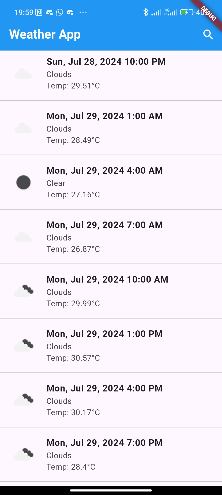
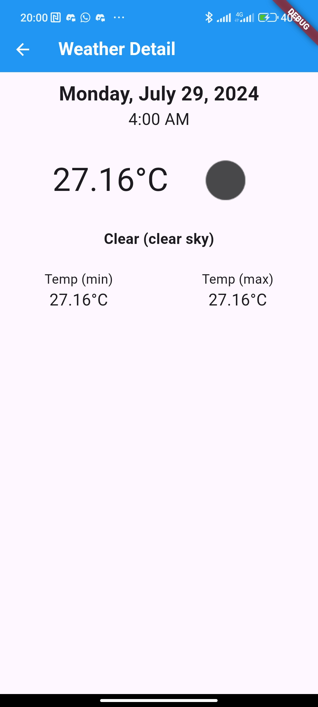
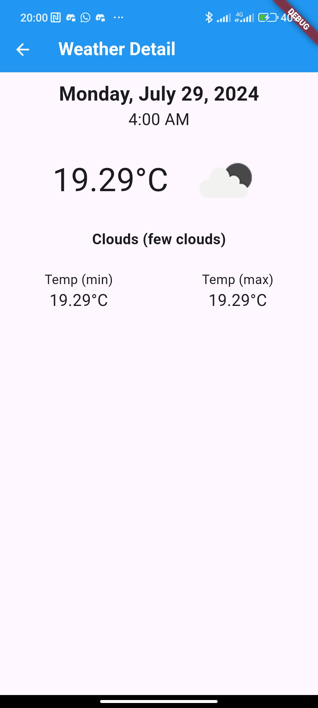
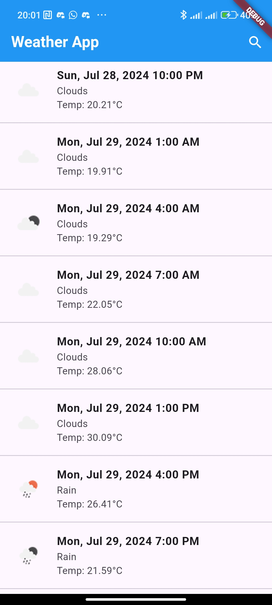
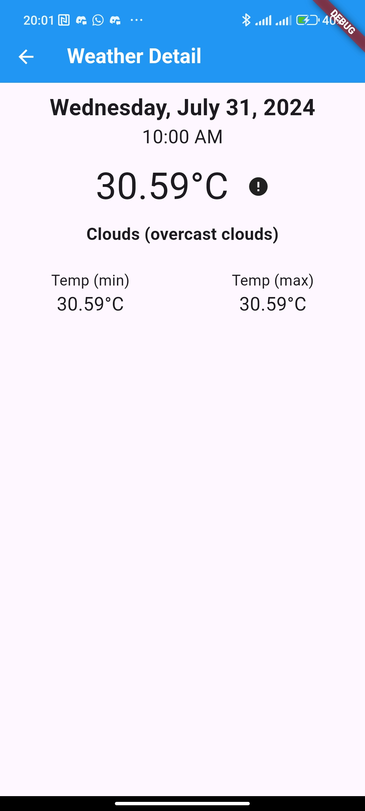

# Delos Weather

Showing weather from OpenWeather API

## Install
1. Run this if pubspec.lock is not exist
```
flutter pub get
```
2. Create your own .env. Change to your OpenWeather API key
```
cp .env.example .env
nano .env
```
3. Run this to generate JSON Serializable and Mockito
```
dart run build_runner build
```
4. Run this to generate the localization class
```
flutter gen-l10n
flutter pub get
```
5. Search for "Run" or "Debug" in your desired IDE 

## Testing
1. Run this from the terminal
```
flutter test
```
2. Or use Ctrl + ; + A in VSCode
3. Or go to testing sidebar on VSCode and "Run Tests" (double triangle arrow)

## Architecture
- Data
    - Data Source
    - Models
    - Repository Implementation
- Domain
    - Entities
    - Repository
    - Usecases
- Presentation
    - Bloc
    - Pages
    - Widgets

## Library Used
### flutter_bloc
**Reason** : Better documentation, many Clean Architecture tutorial uses Bloc

### equatable
**Reason** : Works well for comparing state changes in Bloc

### get_it
**Reason** : Easy dependency injection rather than nested injection

### intl
**Reason** : Format UNIX date from Weather API response

### cached_network_image
**Reason** : Offline support for image

### json_serializable, json_annotation, build_runner
**Reason** : Easier for generate fromJson and toJson

### dio
**Reason** : More customizable, available with pretty_dio_logger

### fpdart
**Reason** : For functional programming on control flow rather than try catch

### flutter_dotenv
**Reason** : Hide API key from source control

### go_router
**Reason** : Make route tidy in one file

### flutter_localization
**Reason** : Easy localization using arb files rather than dart

### mockito
**Reason** : Write less and then generate mocks instantly

### shared_preferences
**Reason** : Offline support for API response

### bloc_test
**Reason** : The test case created is cleaner and easier to read

## Screenshot
### Jakarta (Online)


### Select City

### Malang (Online)


### Malang (Offline)


